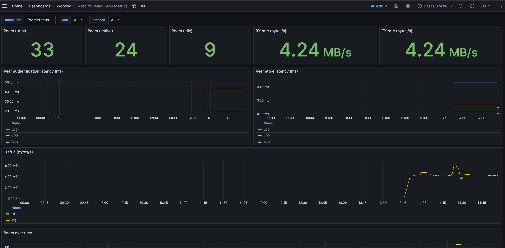
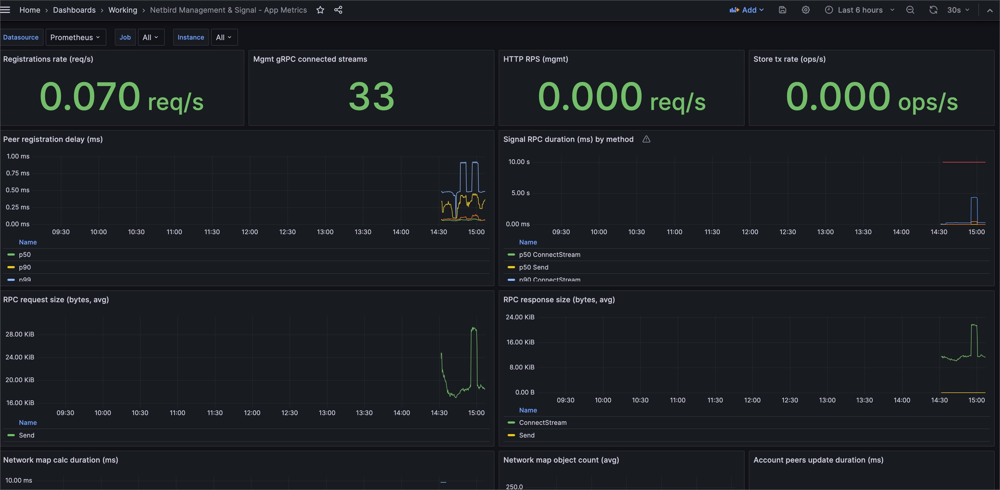

# my-netbird-experience

Hi there, 

I am using Netbird since Mid-2023 in a self hosted environment and want to share my experience. 

## Monitoring

I designed some Dashboards with grafana. I used chatgpt for the base and then extended it. 

Here’s a **short, clean bullet-list description** of the dashboard:

### Netbird Relay – App Metrics Dashboard

First, this is a dashboard showing some metrics about hte netbird relay. It shows

#### Top-level metrics (stat panels)

* **Peers (total):** Total number of peers connected to the relay.
* **Peers (active):** Peers currently active / exchanging data.
* **Peers (idle):** Peers connected but not active.
* **RX rate:** Incoming traffic in bytes/sec (5-minute rate).
* **TX rate:** Outgoing traffic in bytes/sec (5-minute rate).

#### Latency metrics (timeseries)

* **Peer authentication latency:** p50, p90, p99, and average time to authenticate peers.
* **Peer store latency:** p50, p90, p99, and average time to store peer info.

#### Traffic over time

* **RX vs. TX throughput chart:** Historical incoming/outgoing relay traffic.

#### Peer population over time

* Time series of:

  * **Total peers**
  * **Active peers**
  * **Idle peers**
    grouped by relay instance.

#### Dashboard variables

* **Datasource:** Choose Prometheus instance.
* **Job:** Filter metrics by Prometheus job.
* **Instance:** Filter metrics by relay server instance.

